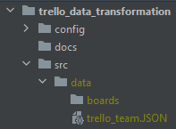

# Trello Data Transformation
## Initial setup
I recommend that you download [PyCharm Community Edition](https://www.jetbrains.com/pycharm/download/) and use that to manage
this project. They have a great tutorial [here](https://www.jetbrains.com/help/pycharm/quick-start-guide.html#create) that
walks you through the process of setting up a project and installing Python. This code should work fine for Python >= 3.7

The project is located on GitHub [here](https://github.com/boicenathan/trello_data_transformation). You can either 
download the project or [clone it by connecting your GitHub to PyCharm](https://www.jetbrains.com/help/pycharm/github.html#register-account). 

Then add a folder named `src/data` in the project directory, and extract the downloaded zip folder from Trello into this `src/data` folder.  It should follow this format `src/data/boards`.

Now that you have all the files you need, create a fresh virtual environment for this project. Then, open PyCharm's terminal
interface and run the command `pip install -r config/requirements.txt`.

### Consolidator
By default after merging all the files it will save as one csv, but if you need to use it in Excel switch `split` to `True` and update `rowsplit` to which row you would like to use as the indicator to split the dataframe.

`rboards` is the list of words we will use when filtering.  If the board has any of these words in their name it will not consolidate the file.

### Trimmer

### Compare

### Count
